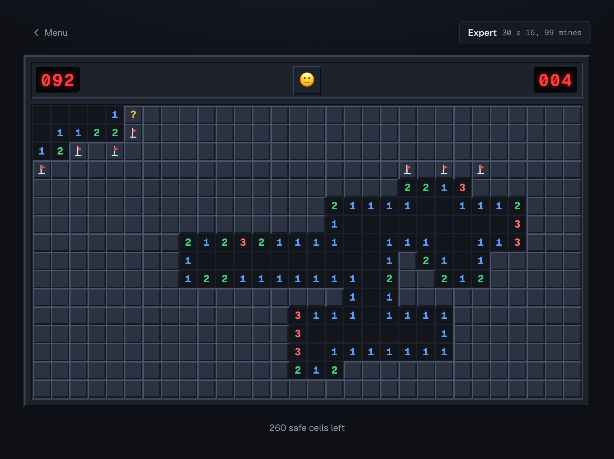

# Minesweeper

Classic Minesweeper in Next.js 16 (React 19, TypeScript): three difficulties, first click always safe,
flood-fill reveals, flag and question marks, clock and mine counter, and best times saved per difficulty.



## Features

- Beginner 9x9 with 10 mines, intermediate 16x16 with 40, expert 30x16 with 99
- First click always safe and always opens an area: mines are placed after it, clear of the cell and its neighbors
- Left click reveals; a zero cell flood-fills outward to its numbered border
- Right click cycles flag, question mark, clear; the counter tracks mines minus flags and can go negative
- Clock starts on the first click, freezes on win or loss, caps at 999
- Loss exposes every mine and marks wrong flags; win flags the remaining mines and reads zero
- Best time per difficulty saved in the browser (localStorage), shown on the menu and after a win
- Main menu field manual with controls and rules

Controls: left click reveal, right click flag / ? / clear, face button new round, Menu to change difficulty.

## Run

Requires Node 20.9 or newer.

```bash
npm install
npm run dev
```

Open http://localhost:3000. Any round can be replayed deterministically with a seed, for example
`/play?difficulty=expert&seed=42`.

## Tests

```bash
npm run test:unit
npm run test:e2e
```

Vitest covers the pure engine: board generation and mine placement invariants fuzzed over seeds, flood
fill, the game reducer, and best-time storage. Playwright drives the real UI through seeded games and
checks reveal, flood fill, flagging, first-click safety, win, loss, and best-time persistence; it starts
the dev server on port 3111 or reuses one already running there. `npm test` runs both.

## License

MIT, see `LICENSE`.
